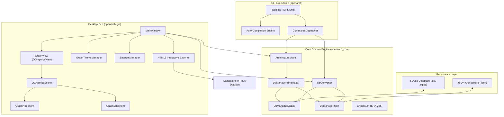

# OpenArch

[](https://en.cppreference.com/w/cpp/17)
[](https://www.qt.io/)
[](https://www.sqlite.org/)
[](https://tiswww.case.edu/php/chet/readline/rltop.html)
[](https://cmake.org/)
[](LICENSE)

**OpenArch** is a high-performance, cross-platform software architecture modeling, visualization, and governance platform. It couples a rich interactive Qt5 desktop diagramming canvas with a feature-packed GNU Readline command-line shell, dual SQLite/JSON storage backends, bidirectional database translation, and self-contained interactive HTML5/SVG reporting.

Whether managing enterprise system designs, conducting formal architecture reviews, or embedding interactive architectural graphs into documentation pipelines, OpenArch provides an end-to-end toolchain for software and system architects.

---

## Table of Contents

- [Key Features](#key-features)
- [System Architecture](#system-architecture)
- [Prerequisites & Dependencies](#prerequisites--dependencies)
- [Building OpenArch](#building-openarch)
- [GUI Usage & Controls](#gui-usage--controls)
  - [Canvas Navigation & Zoom](#canvas-navigation--zoom)
  - [Selection & Inspection](#selection--inspection)
  - [Node Movement & Edge Creation](#node-movement--edge-creation)
  - [Alignment & Distribution](#alignment--distribution)
  - [Modes & Keyboard Shortcuts](#modes--keyboard-shortcuts)
- [Theme Engine](#theme-engine)
- [CLI Reference](#cli-reference)
  - [Interactive Shell Mode](#interactive-shell-mode)
  - [Command List](#command-list)
  - [Standalone Database Conversion](#standalone-database-conversion)
- [Data Storage & Dual-Backend Model](#data-storage--dual-backend-model)
  - [SQLite Schema vs. JSON Structure](#sqlite-schema-vs-json-structure)
  - [Bidirectional Database Conversion](#bidirectional-database-conversion)
- [Interactive HTML5 Export](#interactive-html5-export)
- [Automated Testing](#automated-testing)
- [Directory Layout](#directory-layout)
- [License](#license)

---

## Key Features

- **Interactive Diagramming Canvas (`openarch-gui`)**:
  - Hierarchical container layers and leaf architecture nodes with dynamic parent-child nesting.
  - Orthogonal edge routing with automatic segment alignment and rotated slope-aligned labels.
  - Interactive drag-to-connect tool with orthogonal preview guides and automatic target node snapping.
  - Full-canvas multi-selection, rubber-band marquee selection, and multi-node drag repositioning.
  - Precise alignment (Left, Center H, Right, Top, Middle, Bottom) and distribution (Horizontal, Vertical) tools.
- **Dual Storage Backends (SQLite & JSON)**:
  - First-class support for relational SQLite databases (`.db`, `.sqlite`) and human-readable JSON files (`.json`).
  - Seamless bidirectional conversion with 100% data integrity, preserving attributes, metadata, hierarchy, and reviews.
  - Integrated GUI converter dialog and zero-interaction CLI converter command.
- **Interactive Standalone HTML5 / SVG Export**:
  - Generates standalone, zero-dependency, single-file HTML5 architecture diagrams.
  - Embedded inspector HUD drawer displaying node and edge metadata, attributes, and governance status.
  - Interactive hover effects highlighting incoming and outgoing edges with glowing accents.
  - Built-in pan, zoom, reset HUD controls, and touch/wheel gesture support.
  - High-resolution SVG export for current viewport or whole diagram.
- **Real-Time Live Theming Engine**:
  - Five pre-configured modern themes: **Dark**, **Light**, **Nord**, **Dracula**, and **Blueprint**.
  - Built-in Theme Editor dock with live visual updates across all canvas elements without restarts.
  - Custom themes can be exported, shared, and loaded as standard JSON definitions.
- **Configurable Shortcut System**:
  - Fully customizable keyboard shortcuts with collision detection and conflict prevention.
  - Preserves standard OS conventions (e.g., Cut `Ctrl+X`, Copy `Ctrl+C`, Paste `Ctrl+V`).
  - Persisted user configuration across application launches.
- **Architecture Governance & Tamper Verification**:
  - Formal review state tracking for nodes, layers, and edges with reviewer identity and timestamp logging.
  - Cryptographic SHA-256 checksum generation and integrity verification for tamper-evident architecture specs.
- **Command-Line Interface (`openarch`)**:
  - Interactive REPL shell powered by GNU Readline with automatic command completion and command history.
  - Full CRUD operations on nodes, layers, node-layer associations, and edges.
  - ASCII and JSON graph dumping for CI/CD linting, automation, and headless pipeline verification.

---

## System Architecture



---

## Prerequisites & Dependencies

OpenArch is built using standard C++17 and requires modern build tools and developer libraries.

### Linux (Ubuntu / Debian)

Install all build essentials, Qt5 development packages, SQLite, and GNU Readline:

```bash
sudo apt-get update
sudo apt-get install -y \
    build-essential \
    g++ \
    cmake \
    ninja-build \
    pkg-config \
    qtbase5-dev \
    libqt5svg5-dev \
    libsqlite3-dev \
    libreadline-dev
```

### Fedora / RHEL

```bash
sudo dnf install -y \
    gcc-c++ \
    cmake \
    ninja-build \
    pkgconf-pkg-config \
    qt5-qtbase-devel \
    qt5-qtsvg-devel \
    sqlite-devel \
    readline-devel
```

### Arch Linux

```bash
sudo pacman -S --needed \
    base-devel \
    cmake \
    ninja \
    pkgconf \
    qt5-base \
    qt5-svg \
    sqlite \
    readline
```

---

## Building OpenArch

OpenArch uses CMake (>= 3.16) with out-of-source builds. Ninja is recommended for fast parallel compilation.

### 1. Clone the Repository

```bash
git clone https://github.com/your-org/OpenArch.git
cd OpenArch
```

### 2. Configure with CMake

```bash
cmake -B build -G Ninja -DCMAKE_BUILD_TYPE=Release
```

*(Alternatively, use the default Unix Makefiles generator: `cmake -B build -DCMAKE_BUILD_TYPE=Release`)*

### 3. Compile All Targets

```bash
ninja -C build
```

The build produces the following binaries under `build/`:

| Executable | Description |
| :--- | :--- |
| `build/openarch-gui` | Qt5 Graphical User Interface |
| `build/openarch` | GNU Readline CLI Shell & Converter |
| `build/test_shortcuts` | Unit tests for configurable shortcut manager |
| `build/test_db_converter` | Unit tests for bidirectional SQLite ⇄ JSON conversion |
| `build/test_interactive_html` | Unit tests for interactive HTML5 export and SVG rendering |

---

## GUI Usage & Controls

Launch the desktop interface:

```bash
./build/openarch-gui
```

You can open an existing SQLite database (`.db`) or JSON file (`.json`), or start a new project from the **File** menu.

```
+-------------------------------------------------------------------------+
| OpenArch - [SystemArchitecture.db]                        [-] [o] [x]  |
+-------------------------------------------------------------------------+
| File   Edit   Theme   Settings   Help                                   |
+-------------------------------------------------------------------------+
| [View] [Edit] | [Align Left] [Center] [Right] | [Distribute H] [Dist V] |
+---------------+------------------------------------------+--------------+
| Architecture  | Interactive Diagram Canvas               | Theme Editor |
| > Layers      |                                          | [Dark     v] |
|   * Frontend  |    +-------------------+                 | Background   |
|   * Services  |    |   API Gateway     |                 | Primary Node |
| > Nodes       |    +--------+----------+                 | Edges        |
|   * AuthSvc   |             | (HTTPS)                    | Text Color   |
|   * UserSvc   |             v                            |              |
|   * Payment   |    +-------------------+                 | [Apply]      |
|               |    |   Auth Service    |                 | [Save Theme] |
+---------------+------------------------------------------+--------------+
| Status: Ready | Primary Node: API Gateway | Zoom: 100%                 |
+-------------------------------------------------------------------------+
```

### Canvas Navigation & Zoom

| Action | Control | Description |
| :--- | :--- | :--- |
| **Pan Canvas** | `Space` + `Left-Click` + `Drag` | Pans the diagram viewport |
| **Pan Canvas (Direct)** | `Middle-Click` + `Drag` | Pans the diagram viewport directly |
| **Viewport Zoom** | `Mouse Wheel` | Smoothly zooms in/out centered on viewport |
| **Cursor-Anchored Zoom** | `Space` + `Mouse Wheel` | Zooms in/out anchored to the mouse pointer |

### Selection & Inspection

| Action | Control | Description |
| :--- | :--- | :--- |
| **Select Node** | `Left-Click` on Node | Selects the node and marks it as the **Primary Node** |
| **Toggle Multi-Select Node** | `Ctrl` + `Left-Click` on Node | Adds or removes the node from the selection group |
| **Select Edge** | `Left-Click` on Edge | Selects the edge and opens edge inspector |
| **Toggle Multi-Select Edge** | `Ctrl` + `Left-Click` on Edge | Adds or removes the edge from the selection group |
| **Marquee Selection** | `Left-Click` + `Drag` on Canvas | Draws a rubber-band box to select multiple items |
| **Clear Selection** | `Left-Click` on empty Canvas | Clears all active selections |

### Node Movement & Edge Creation

| Action | Control | Description |
| :--- | :--- | :--- |
| **Move Nodes** | `Left-Click` + `Drag` on Node | Repositions selected node(s); connected edges dynamically update orthogonal routes |
| **Connect Nodes** | `Shift` + `Left-Click` + `Drag` from Node | Suppresses movement and draws an orthogonal connection guide; snaps and connects to target node on release |
| **Edit Item** | `Double-Click` on Node / Edge | Opens the Node/Edge Properties & Metadata Editor dialog |
| **Context Menu** | `Right-Click` on Node / Edge / Canvas | Context-specific options (Add Node, Add Layer, Edit, Delete, Duplicate) |

### Alignment & Distribution

Select multiple nodes (with a Primary Node chosen) and use the toolbar or **Edit** menu:

- **Horizontal Alignment**: Left (`Align Left`), Center (`Align Center H`), Right (`Align Right`).
- **Vertical Alignment**: Top (`Align Top`), Middle (`Align Center V`), Bottom (`Align Bottom`).
- **Distribution**: Evenly spaces three or more nodes horizontally or vertically.

### Modes & Keyboard Shortcuts

OpenArch features both standard shortcuts and configurable actions via **Settings -> Configure Shortcuts...**:

| Feature / Action | Default Key | Type | Description |
| :--- | :--- | :--- | :--- |
| **View Mode** | `V` | Configurable | Locks layout and enables navigation/inspection mode |
| **Edit / Layout Mode** | `L` | Configurable | Enables full positioning, connecting, and editing |
| **Delete Selected** | `Delete` / `Backspace` | Configurable | Confirms and removes selected nodes and edges |
| **Cut** | `Ctrl+X` | Standard | Cuts selected items to clipboard |
| **Copy** | `Ctrl+C` | Standard | Copies selected items to clipboard |
| **Paste** | `Ctrl+V` | Standard | Pastes nodes from clipboard with offset |
| **Duplicate** | `Ctrl+D` | Configurable | Duplicates selected nodes in place |
| **Save Layout** | `Ctrl+S` | Configurable | Commits coordinates and dimensions to database |
| **Connect Selected** | `Ctrl+K` | Configurable | Prompts to connect selected nodes |
| **Align Left / Top** | Configurable | Configurable | Aligns multi-selection to Primary Node |
| **Distribute H / V** | Configurable | Configurable | Spreads selected nodes evenly |

---

## Theme Engine

OpenArch includes an embedded theme manager with a real-time property editor:

- **Built-in Presets**:
  - `Dark` (Default high-contrast developer theme)
  - `Light` (Clean print/documentation theme)
  - `Nord` (Arctic, elegant dark palette)
  - `Dracula` (Vibrant modern developer theme)
  - `Blueprint` (Engineering cad-style blueprint palette)
- **Live Canvas Updates**: Changes made in the Theme Editor dock immediately invalidate scene render caches and refresh node headers, body fills, connection strokes, labels, and badges.
- **Custom Themes**: Load or save custom JSON theme definitions under `src/gui/theme/themes/` or any custom path.

---

## CLI Reference

OpenArch provides an interactive shell and batch command utility via the `openarch` binary.

### Interactive Shell Mode

To inspect or edit a database in an interactive shell:

```bash
./build/openarch my_architecture.db
# or with a JSON file:
./build/openarch my_architecture.json
```

The shell features GNU Readline tab-completion, history navigation (Up/Down arrow keys), and command-line editing.

```
Nodes:
  add_node <name> <type> [parentId|-]
  update_node <id> <name> <type> [parentId|-]
  set_node_meta <id> <json>
  set_node_attr <id> <json>
  review_node <id> <reviewer>
  del_node <id>
  list_nodes
...
> 
```

### Command List

#### 1. Nodes Management
- `add_node <name> <type> [parentId|-]`: Creates a new node (e.g., `add_node AuthService microservice -`).
- `update_node <id> <name> <type> [parentId|-]`: Modifies an existing node.
- `set_node_meta <id> <json>`: Sets arbitrary JSON metadata on a node (e.g., `set_node_meta 1 {"repo":"https://github.com/..."}`).
- `set_node_attr <id> <json>`: Updates layout coordinates and styling attributes (e.g., `set_node_attr 1 {"x":150,"y":300}`).
- `review_node <id> <reviewer>`: Commits a formal governance approval timestamped with reviewer ID.
- `del_node <id>`: Deletes a node and cascades attached edges.
- `list_nodes`: Prints a formatted table of all nodes.

#### 2. Layers Management
- `add_layer <name> <kind>`: Creates a logical architecture boundary (e.g., `add_layer Backend Tier`).
- `update_layer <id> <name> <kind>`: Renames or updates layer kind.
- `set_layer_meta <id> <json>`: Sets layer metadata.
- `set_layer_attr <id> <json>`: Sets layer layout attributes.
- `review_layer <id> <reviewer>`: Marks layer as formally reviewed.
- `del_layer <id>`: Removes layer.
- `list_layers`: Lists all registered layers.

#### 3. Node-Layer Associations
- `add_node_layer <nodeId> <layerId>`: Maps a node to a layer.
- `del_node_layer <nodeId> <layerId>`: Unmaps a node from a layer.
- `list_layer_nodes <layerId>`: Lists all nodes assigned to a layer.

#### 4. Edges & Connections
- `add_edge <srcNode> <srcLayer> <dstNode> <dstLayer> <type>`: Creates a directed edge between nodes (e.g., `add_edge 1 1 2 1 gRPC`).
- `update_edge <id> <type>`: Updates edge protocol/type.
- `set_edge_meta <id> <json>`: Attaches metadata to edge (e.g. latency, bandwidth requirements).
- `set_edge_attr <id> <json>`: Attaches routing attributes.
- `review_edge <id> <reviewer>`: Approves edge for architectural compliance.
- `del_edge <id>`: Removes edge.
- `list_edges`: Prints all edges.

#### 5. Graph Output & Inspection
- `dump_graph [layerId]`: Prints a clean human-readable ASCII summary of the architecture.
- `dump_graph_json [layerId]`: Emits the full graph as structured JSON.

#### 6. In-Shell Conversion
- `convert <target_path>`: Converts the currently open database to a target `.json` or `.db` file.
- `convert <source_path> <target_path>`: Converts any database file directly from within the shell.

---

### Standalone Database Conversion

Convert architecture files between SQLite and JSON headlessly without entering the interactive shell:

```bash
# Convert SQLite to JSON
./build/openarch convert enterprise_arch.db enterprise_arch.json

# Convert JSON to SQLite
./build/openarch convert enterprise_arch.json enterprise_arch.db
```

The converter automatically validates schema constraints, generates default layout attributes if missing, and verifies data integrity.

---

## Data Storage & Dual-Backend Model

OpenArch supports two interchangeable storage backends:

1. **SQLite (`DbManagerSQLite`)**: A robust, single-file relational database with ACID transactions and strict referential integrity.
2. **JSON (`DbManagerJson`)**: A clean, human-readable file suitable for Git version control and diffing.

### SQLite Schema vs. JSON Structure

```
+------------------------------------+------------------------------------+
| SQLite Relational Schema           | JSON Architecture Specification    |
+------------------------------------+------------------------------------+
| tables:                            | {                                  |
|   - nodes (id, name, type, parent) |   "nodes": [                       |
|   - layers (id, name, kind)        |     { "id": 1, "name": "Gateway",  |
|   - node_layers (node_id, layer_id)|       "type": "service", ... }     |
|   - edges (id, src_node, dst_node, |   ],                               |
|            src_layer, dst_layer)   |   "layers": [ ... ],               |
|   - reviews (item_type, item_id,   |   "edges": [                       |
|              reviewer, timestamp)  |     { "id": 1, "source": 1, ... }  |
|   - attributes (x, y, w, h, ...)   |   ],                               |
|   - metadata (custom json kv)      |   "checksum": "sha256..."          |
|   - checksum (hash, timestamp)     | }                                  |
+------------------------------------+------------------------------------+
```

### Bidirectional Database Conversion

The [`DbConverter`](file:///workspace/OpenArch/src/db/DbConverter.h) engine translates all entities with full fidelity:

- **Nodes & Hierarchies**: Translates relational foreign keys (`parentId`) into JSON tree structures and vice-versa.
- **Node-Layer Maps**: Preserves many-to-many relationships across layers.
- **Orthogonal Layout Attributes**: Node coordinates (`x`, `y`, `width`, `height`), colors, and custom visual settings.
- **Edge Routing & Labels**: Edge labels, arrow endpoints, layer bindings, and metadata.
- **Governance Review History**: Reviewer names, timestamps, and approval statuses.
- **Checksum Verification**: Re-computes SHA-256 signatures to confirm zero data corruption during transfer.

In the GUI, access this anytime via **File -> Convert Database (JSON ⇄ SQLite)...**.

---

## Interactive HTML5 Export

OpenArch exports standalone, interactive HTML5 documents that require no web server or external dependencies.

### Features of the HTML5 Export

- **Embedded Vector Graphics**: The diagram is embedded directly as clean SVG with pixel-perfect matching of the desktop GUI canvas.
- **Dynamic Glow & Hover Effects**: Hovering any node highlights all incoming and outgoing connections in real-time, dimming unrelated diagram elements.
- **Hit Detection & Routing**: Invisible 20px hitboxes ensure effortless clicking and hovering on orthogonal edges and junctions.
- **Interactive Inspector HUD**: Clicking any node or edge slides open an inspector drawer showing:
  - Node Name, Type, and Layer Group.
  - Review Status and Sign-Off Signature.
  - Custom Key-Value Attributes and Metadata.
- **Navigation Controls**: Built-in floating HUD for Zoom In, Zoom Out, Reset View, and Canvas Panning.
- **100% Offline Compatible**: All CSS, SVG definitions, and vanilla JavaScript are bundled into a single `.html` file.

To export from the GUI:
1. Open your architecture.
2. Select **File -> Export Interactive HTML...**.
3. Choose destination path and open the resulting file in any modern web browser (Chrome, Firefox, Safari, Edge).

---

## Automated Testing

OpenArch includes an automated test suite verifying core components, shortcut mapping, database conversion, and interactive HTML generation.

### Run All Tests via CTest

Execute the test suite headlessly:

```bash
ASAN_OPTIONS=detect_leaks=0 QT_QPA_PLATFORM=offscreen ctest --test-dir build --output-on-failure
```

### Run Individual Test Binaries

```bash
# 1. Configurable Shortcut System & Collision Prevention
./build/test_shortcuts

# 2. Bidirectional SQLite <-> JSON Database Converter
./build/test_db_converter

# 3. Interactive HTML Export & SVG DOM Verification
ASAN_OPTIONS=detect_leaks=0 QT_QPA_PLATFORM=offscreen ./build/test_interactive_html
```

---

## Directory Layout

```
OpenArch/
├── CMakeLists.txt             # Main CMake configuration file
├── Requirements               # Functional requirements & controls specification
├── resources.qrc              # Qt resource catalog (SVG icons, UI assets)
├── assets/                    # Application icons, SVGs, and diagram assets
│   └── icons/                 # Toolbar and menu vector icons
├── src/
│   ├── cli/                   # CLI shell implementation
│   │   └── cli.cpp            # GNU Readline REPL & argument parser
│   ├── core/                  # Core domain and data structures
│   │   ├── ArchitectureModel.h/.cpp # Domain entities (Node, Layer, Edge)
│   │   ├── Checksum.h/.cpp          # SHA-256 tamper verification
│   │   ├── GraphJson.h/.cpp         # JSON graph serialization
│   │   └── Types.h                  # Common ID and result types
│   ├── db/                    # Persistence and conversion engine
│   │   ├── DbManager.h              # Abstract database interface
│   │   ├── DbManagerSQLite.h/.cpp   # SQLite storage implementation
│   │   ├── DbManagerJson.h/.cpp     # JSON storage implementation
│   │   └── DbConverter.h/.cpp       # Bidirectional SQLite <-> JSON converter
│   └── gui/                   # Qt5 desktop application
│       ├── main.cpp                 # GUI entry point
│       ├── MainWindow.h/.cpp        # Main application window & menus
│       ├── GraphView.h/.cpp         # QGraphicsView canvas & HTML5 exporter
│       ├── ShortcutManager.h/.cpp   # Configurable keyboard shortcuts
│       ├── GraphModules/            # Scene visual items
│       │   ├── GraphNodeItem.h/.cpp # Containers & leaf nodes
│       │   └── GraphEdgeItem.h/.cpp # Orthogonal edges with rotated labels
│       ├── dialogs/                 # Editor and configuration dialogs
│       │   ├── ShortcutConfigDialog.h/.cpp # Keyboard mapping UI
│       │   └── ConvertDialog.h/.cpp        # Database conversion wizard
│       └── theme/                   # Theming system
│           ├── GraphThemeManager.h/.cpp # Theme manager & live applicator
│           ├── ThemeEditorDock.h/.cpp   # Real-time theme editor dock
│           └── themes/                  # JSON theme presets (Dark, Light, Nord, Dracula, Blueprint)
└── tests/                     # Automated test suites
    ├── test_shortcuts.cpp           # Shortcut manager tests
    ├── test_db_converter.cpp        # SQLite/JSON converter tests
    └── test_interactive_html.cpp    # Interactive HTML exporter tests
```

---

## License

This project is licensed under the MIT License - see the [LICENSE](LICENSE) file for details.
